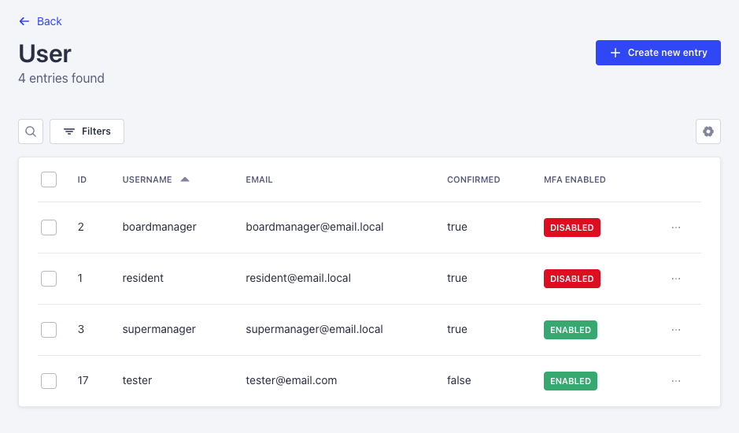
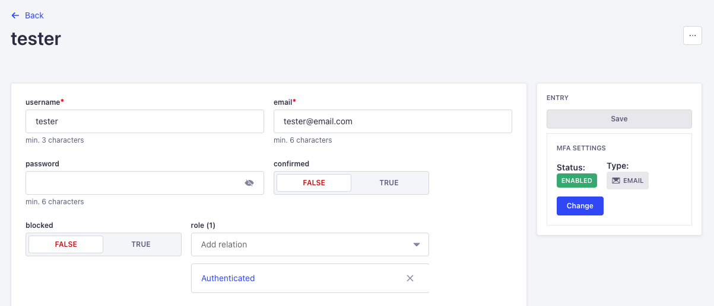
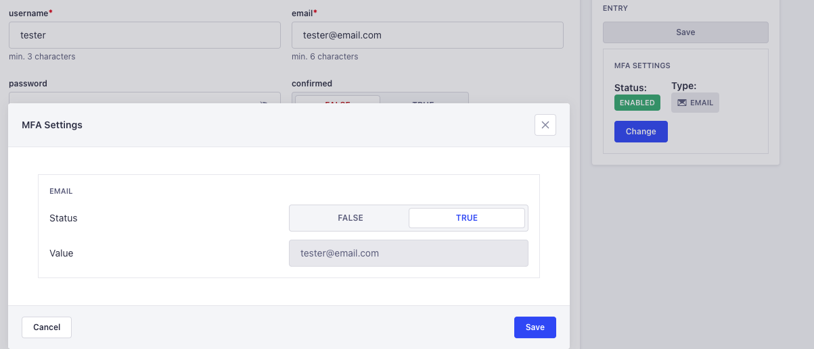
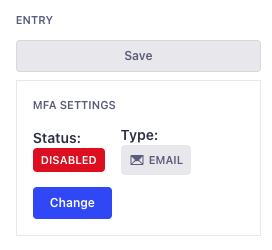
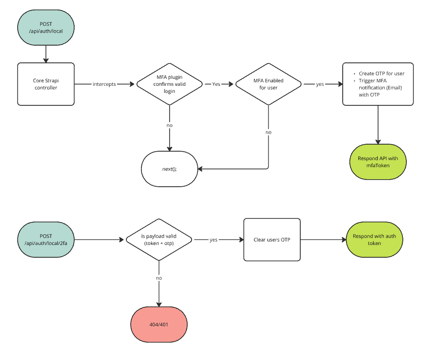
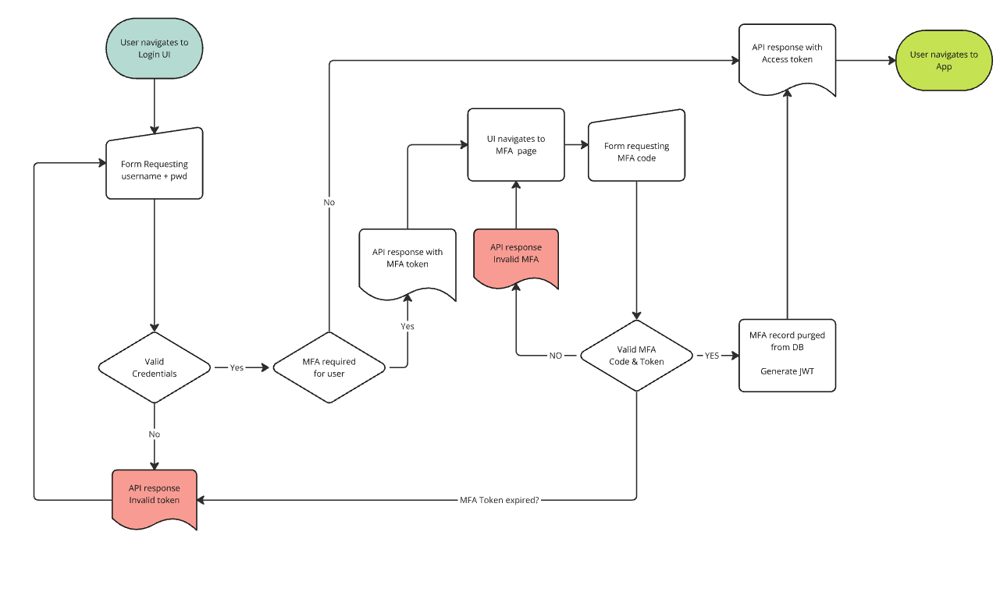

#

<h1 align="center">
  Strapi5 Users 2FA plugin
</h1>

Strapi Plugin that extends the local authorization functionality to provide multi-factor authentication (MFA/2FA).

Currently in BETA. For this initial release the MFA relies on email only.

This token works by creating a temporary MFA token, and blocking login until the MFA + the OTP are provided.

### Admin GUI

- A new column is displayed in the User list view.

  

- Once in the User edit view, a new section shows the MFA settings, with a CTA to edit the current configuration.

  
  
  

## ⚠️ Compatibility with Strapi versions

- This plugin relies on Strapi5 new `documentId`. It will not work with earlier versions!
- Works with `local` provider only.

## ⚙️ Installation

To install the Strapi MFA Plugin, simply run one of the following command:

```
npm install @redon2inc/strapi-plugin-user-2fa
```

```
yarn add @redon2inc/strapi-plugin-user-2fa
```

## Config

You will need to have a working email provider in place.

This component relies on extending the `user-permissions` types.

Modify your plugins file `config/plugin.ts` to have the following:

```javascript

  // ..other plugins
  "user-2fa": {
    enabled: true,
    config: {
      mfaTokenExpiresIn: "5m", // length of the mfa token to expire
      mfaTokenSecret: env("MFA_JWT_SECRET") || "SomethingSecret",
      forceMFA: true, // this setting enables MFA on user creation
      email: {
        fromAddress: 'from@address.com',
        fromName: 'My From Name',
        replyTo: 'reply@local.com',
        subject: 'OTP for your  sign-in', // currently used only for OTP subjects. TODO: migrate to templates
      },
    },
  },
```

## API Usage:

if user has MFA configured and enabled the `POST`:`/api/auth/local` will respond with the following:

```json
{
  "mfaToken": "token..."
}
```

once the user retreives the OTP the following API should be called:  
`POST`:`/api/auth/local/2fa` with the following payload:

```json
{
  "mfaToken": "mfaToken...",
  "mfaOTP": "OTPValue"
}
```

if the MFA token and the OTP are valid, the API will return

```json
{
  "jwt": "NewAccessToken..",
  "user": {
    /* user object */
  }
}
```

## TODO:

- API for user to be able to change his own settings
- Improve Email template
- Confirm compatability with refresh token plugin

## Workflows:

- API

  

- End to end

  

- Registration

  
