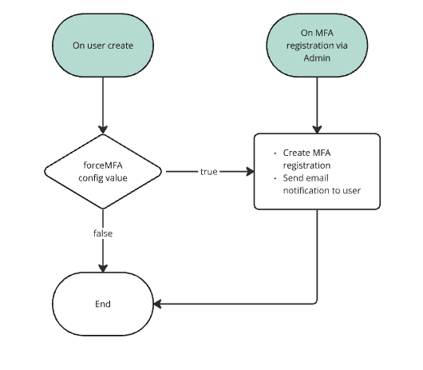

#

<h1 align="center">
  Strapi5 Users 2FA plugin
</h1>

Strapi Plugin that extends the local authorization functionality to provide multi-factor authentication (MFA/2FA).

Currently in BETA. For this initial release the MFA relies on email only.

This token works by creating a temporary MFA token, and blocking login until the MFA + the OTP are provided.

### Admin GUI

- A new column is displayed in the User list view.

  

- Once in the User edit view, a new section shows the MFA settings, with a CTA to edit the current configuration.

  
  
  

### Admin Plugin Settings

- This plugin extends user-permissions email store.

  _NOTE:_

  Currently Strapi's plugin has the `Email Template` view hardcoded to their default two templates.
  Our plugins provides a new view that allows editing to the existing and the newly created templates for this plugin.

  

- As the plugin provides some User APIs, the admin can modify the permissions:

  By default the `Authenticated` role has access to view their won MFA registrations. If Admin wants to allow this role to modify their own registrations the `updateMyMFA` action needs to be enabled.

  

## ⚠️ Compatibility with Strapi versions

- This plugin relies on Strapi5 new `documentId`. It will not work with earlier versions!
- Works with `local` provider only.

## ⚙️ Installation

To install the Strapi MFA Plugin, simply run one of the following command:

```
npm install strapi-plugin-user-2fa
```

```
yarn add strapi-plugin-user-2fa
```

## Config

You will need to have a working email provider in place.

This component relies on extending the `user-permissions` types.

Modify your plugins file `config/plugin.ts` to have the following:

```javascript

  // ..other plugins
  "user-2fa": {
    enabled: true,
    config: {
      mfaTokenExpiresIn: "5m", // length of the mfa token to expire
      mfaTokenSecret: env("MFA_JWT_SECRET") || "SomethingSecret",
      forceMFA: true, // this setting enables MFA on user creation
    },
  },
```

## API Usage:

### User Authentication

if user has MFA configured and enabled the `POST`:`/api/auth/local` will respond with the following:

```json
{
  "mfaToken": "token..."
}
```

once the user retrieves the OTP the following API should be called:  
`POST`:`/api/auth/local/2fa` with the following payload:

```json
{
  "mfaToken": "mfaToken...",
  "mfaOTP": "OTPValue"
}
```

if the MFA token and the OTP are valid, the API will return

```json
{
  "jwt": "NewAccessToken..",
  "user": {
    /* user object */
  }
}
```

### User settings

A user with a valid token is able to query `GET`:`/api/user-2fa/me` to get a list of MFA registrations.
the API response with the following:

```javascript
[
  // list of registration objects
  {
    id: 1,
    documentId: 'nhsw180pg2oh86m40zs5n8ht',
    enabled: false,
    createdAt: '2025-03-16T02:37:52.236Z',
    updatedAt: '2025-03-16T03:38:28.100Z',
    publishedAt: '2025-03-16T03:38:28.097Z',
    locale: null,
    type: 'email',
    value: 'fake@email.local',
  },
];
```

User will be able to enable and or disable their own registrations using `PATCH`:`/api/user-2fa/me/:documentId` with the following payload:

```json
{
  "data": {
    "enabled": true
  }
}
```

the API will respond with the updated record:

```javascript
[
  // list of registration objects
  {
    id: 1,
    documentId: 'nhsw180pg2oh86m40zs5n8ht',
    enabled: true,
    createdAt: '2025-03-16T02:37:52.236Z',
    updatedAt: '2025-03-16T03:38:28.100Z',
    publishedAt: '2025-03-16T03:38:28.097Z',
    locale: null,
    type: 'email',
    value: 'fake@email.local',
  },
];
```

## TODO:

- Confirm compatibility with refresh token plugin

## Workflows:

- API

  

- End to end

  

- Registration

  
